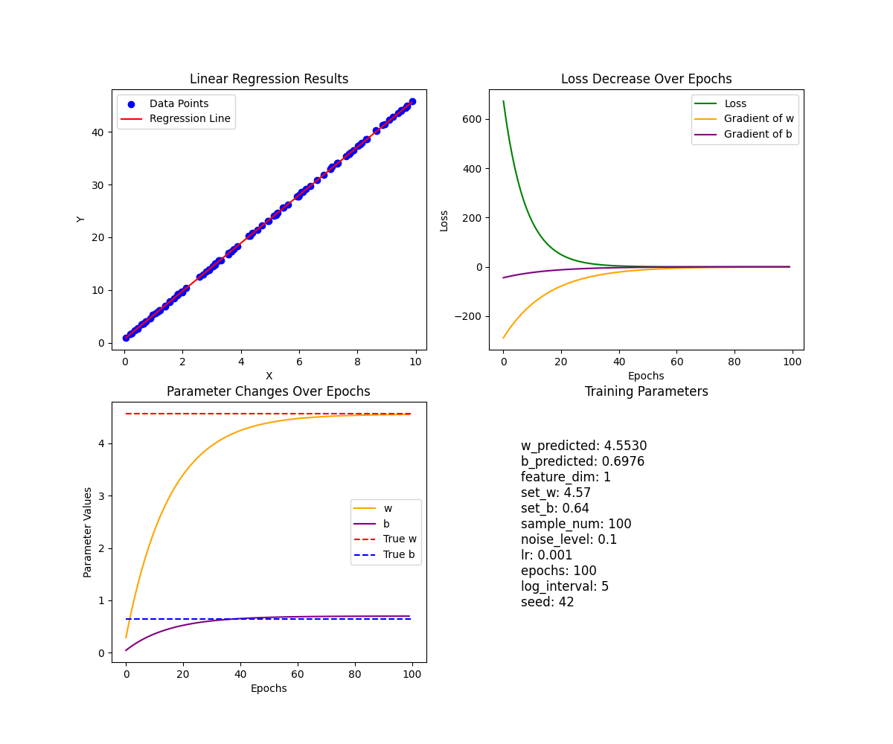
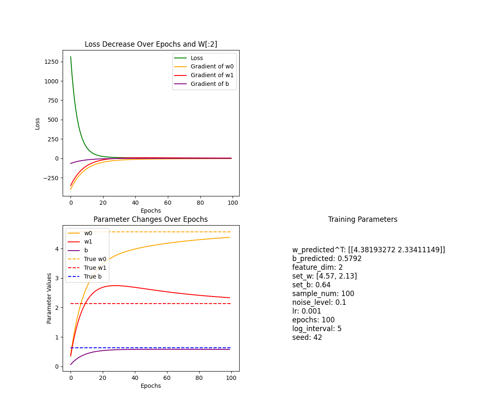

# Linear Regression

## 线性回归问题

核心目标：通过拟合线性函数让模型的预测结果尽可能接近真实数据。

* 线性函数： $y = WX + B$，其中x可为标量，也可为向量。

关键原理：
* 使用梯度下降方法迭代更新参数
* 使用MSE衡量误差
* 可学习参数 $W, B$ 

# 理论推导及矩阵计算

## 单变量实现

### 主要公式

**单个样本点**：
* 线性映射： $y = wx + b$
* 损失计算： $loss = \sum_{i}^{n} (y - (wx + b))^2$
* 偏导计算
    * $\frac{\partial (loss)}{\partial w} = -2(y - (wx + b))x$
    * $\frac{\partial (loss)}{\partial b} = -2(y - (wx + b))$

**矩阵形式**（堆叠N个样本点为列向量）
* 线性映射： $Y = wX + b$
* 损失计算： $loss = \frac{1}{N}\textbf{1}^T(Y - (wX + b))^2$
* 偏导计算：
    * $\frac{\partial (loss)}{\partial w} = -\frac{2}{N}(Y - (wX + b)) \cdot X$ 一维向量用点积
    * $\frac{\partial (loss)}{\partial b} = -\frac{2}{N}(Y - (wX + b))\cdot \textbf{1}$


### 代码实现

Tips:
* np.random.seed() 固定随机种子，确保结果可复现

### 绘图展示

* 最终拟合图
* 损失下降图（含梯度）
* 参数变化图



可以尝试调整不同超参数得到不同的结果

## 多变量拓展

> 多变量拓展的计算公式和偏导计算需用重写，用新的模型进行训练

### 公式

**单个样本点**：
* 线性映射： $y = \sum_i^n w_ix_i + b$
* 损失计算： $loss = \sum_{i}^{n} (y - (\sum_i^n w_ix_i + b))^2$
* 偏导计算
    * $\frac{\partial (loss)}{\partial w_i} = -2(y - (\sum_i^n w_ix_i + b))x_i$
    * $\frac{\partial (loss)}{\partial b} = -2(y - (wx + b))$


**矩阵形式**（堆叠N个样本点为列向量）
* 线性映射： $Y = X @ W + b$
* 损失计算： $loss = \frac{1}{N}\textbf{1}^T(Y - (XW + b))^2$
* 偏导计算：
    * $\frac{\partial (loss)}{W} = -\frac{2}{N}(Y - (XW + b)) \cdot X$
        * $\frac{\partial (loss)}{\partial w_i} = -\frac{2}{N}(Y - (XW + b)) \cdot X_{[:, i]}$
    * $\frac{\partial (loss)}{\partial b} = -\frac{2}{N}\textbf{1}^T(Y - (XW + b))$


**维度分析**
* 线性映射: $Y_{(N, 1)}= X_{(N, f)} @ W_{(f, 1)}$
* 损失: $loss_{标量} = \textbf{1}^TY_(WX + b)$
* W偏导计算：$dW_{(f, 1)} = -\frac{2}{N} X_{(f, N)}^T \cdot(Y_{(N, 1)} - \hat Y_{(N, 1)})$ 广播点积
    * $dw_i = -\frac{2}{N} (Y_{(N, 1)} - \hat Y_{(N, 1)}) \cdot X_{[:, i],(N, 1)}$

最终体现在代码上，主要就是W维度的变化以及前向传播，反向梯度计算时计算操作的变化。

# 运行

`python run.py`

参数配置
```python
# 单变量
hyperparams = {
    # 数据
    "feature_dim": 1,
    "set_w": 4.57,
    # "set_w": [10.57, 2.13],
    "set_b": 0.64,
    "sample_num": 100,
    "noise_level": 0.1,
    # 训练
    "lr": 1e-3,
    "epochs": 100,
    "log_interval": 5,
    "seed": 42
}

# 多变量
    hyperparams = {
        # 数据
        "feature_dim": 2,
        # "set_w": 4.57,
        "set_w": [10.57, 2.13],
        "set_b": 0.64,
        "sample_num": 100,
        "noise_level": 0.1,
        # 训练
        "lr": 1e-3,
        "epochs": 100,
        "log_interval": 5,
        "seed": 42
    }
```

### 绘图展示

* 损失下降图（含梯度）
* 参数变化图



一个有趣的现象是， $w_1$不是直接逼近真值，而是先上升再回降

暂留问题，能否通过公式推导找到 $w_1$变换曲线的极大值点发生了什么


# 讨论

* 可以通过调参进一步实验
    * 数据量的影响？
    * 噪声的影响？
    * 学习率的影响（公式已知情况下，能否直接通过学习率推导出最终loss范围）
* 当前需要对数据内在分布做出强假设，在已知函数空间的情况下针对特定计算公式硬编码`forward`和`backward`过程。不同的公式求导需要手动推导并硬编码，这就导致对于每种函数空间的假设都需要编写一个独特的梯度求导（为了方便，这里单变量和多变量都采用了单独的模型）
    * 尽管单变量可以使用多变量模型实现，但两者实际编码过程中用到的公式矩阵化程度是不同的，这里通过这种不同去深入理解标量公式循环实现与矩阵压缩表示公式的区别。
    * 尝试了解深度学习框架如何实现自动求导`auto gradient`
* 数据上，当数据量极大时，一次性输入模型显然不现实，这时考虑两种解决方案
    * 一：每个样本单独处理（并行性低，无法充分利用硬件加速；受单个噪声样本影响大）
    * 二：引入batch概念，分批次处理（提高可并行性； 平滑梯度波动，增强训练稳定性）
    * 对于batch的实现，可以了解框架的`dataloader`类

## 下一步

从以下方向考虑
* 非线性函数能否拟合
* 为何说足够宽的单层神经网络可以拟合所有函数
* 实现`Linear`和`activate funcfion`后，转到`pytorch`框架