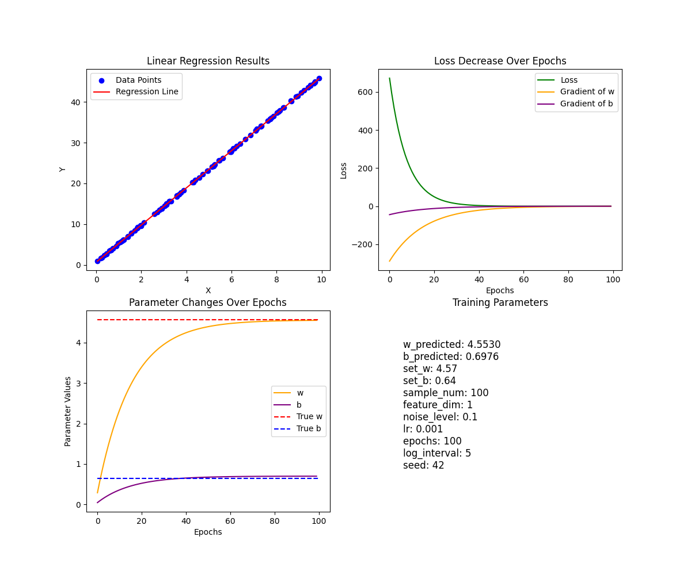

# Linear Regression

## 线性回归问题

核心目标：通过拟合线性函数让模型的预测结果尽可能接近真实数据。

* 线性函数：$y = WX + B$，其中x可为标量，也可为向量。

关键原理：
* 使用梯度下降方法迭代更新参数
* 使用MSE衡量误差
* 可学习参数$W, B$

# 运行

`python run.py`

## 单变量实现

### 主要公式

**单个样本点**：
* 线性映射：$y = wx + b$
* 损失计算：$loss = \sum_{i}^{n} (y - (wx + b))^2$
* 偏导计算
    * $\frac{\partial (loss)}{\partial w} = -2(y - (wx + b))x$
    * $\frac{\partial (loss)}{\partial b} = -2(y - (wx + b))$

**矩阵形式**（堆叠N个样本点为列向量）
* 线性映射：$Y = wX + b$
* 损失计算：$loss = \frac{1}{N}\textbf{1}^T(Y - (wX + b))^2$
* 偏导计算：
    * $\frac{\partial (loss)}{\partial w} = -\frac{2}{N}\textbf{1}^T(Y - (wX + b))X$
    * $\frac{\partial (loss)}{\partial b} = -\frac{2}{N}\textbf{1}^T(Y - (wX + b))$

### 代码实现

Tips:
* np.random.seed() 固定随机种子，确保结果可复现

### 绘图展示

* 最终拟合图
* 损失下降图（含梯度）
* 参数变化图

可以尝试调整不同超参数得到不同的结果

## 多变量拓展

### 公式

* 矩阵乘顺序需要明确

**矩阵形式**（堆叠N个样本点为列向量）
* 线性映射：$Y = XW + b$
* 损失计算：$loss = \frac{1}{N}\textbf{1}^T(Y - (XW + b))^2$
* 偏导计算：
    * $\frac{\partial (loss)}{\partial w} = -\frac{2}{N}\textbf{1}^T(Y - (XW + b))X$
    * $\frac{\partial (loss)}{\partial b} = -\frac{2}{N}\textbf{1}^T(Y - (XW + b))$

**维度分析**
* 线性映射:$Y（N, 1）= X(N, f) @ W(f, 1)$
* dw, db(N, 1)
这样计算有问题呢。

